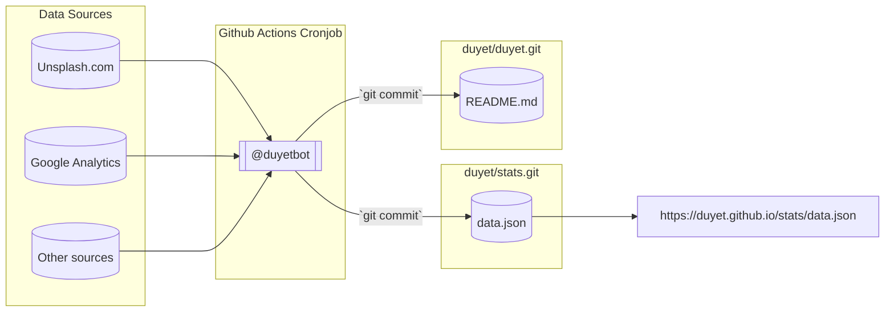

# stats

```mermaid
graph LR

    subgraph box_data_sources ["Data Sources"]
      datasource_1[(Unsplash.com)]
      datasource_2[(Google Analytics)]
      datasource_3[(Other sources)]
    end

    subgraph box_github_actions ["Github Actions Cronjob"]
      github_duyetbot[["@duyetbot"]]
    end

    subgraph box_repo_stats ["duyet/stats.git"]
      data[("data.json")]
    end
    
    subgraph box_repo_readme ["duyet/duyet.git"]
      readme[("README.md")]
    end
    
    api["https://duyet.github.io/stats/data.json"]
    click api href "https://duyet.github.io/stats/data.json" _blank

    datasource_1 & datasource_2 & datasource_3 ---> github_duyetbot -- `git commit` --> data & readme
    data --->  api

```
